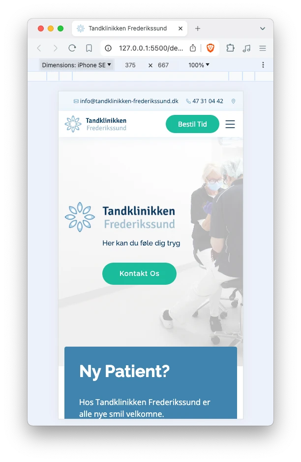
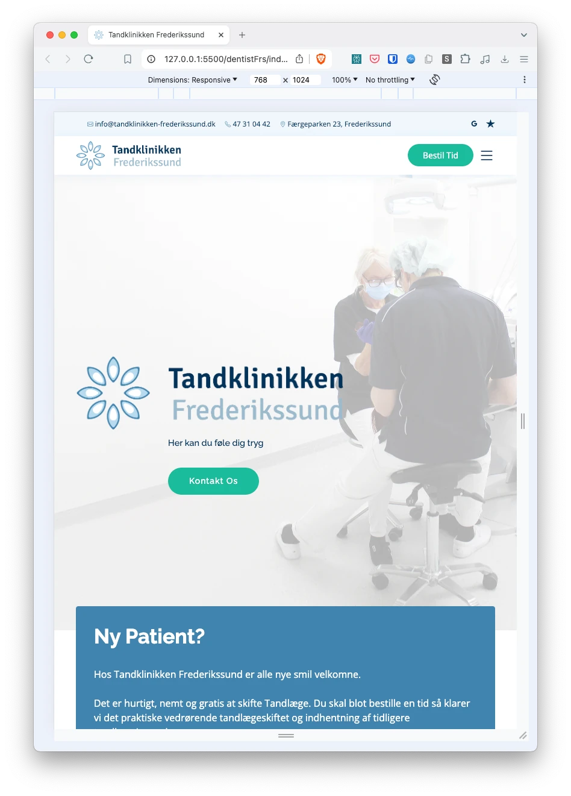
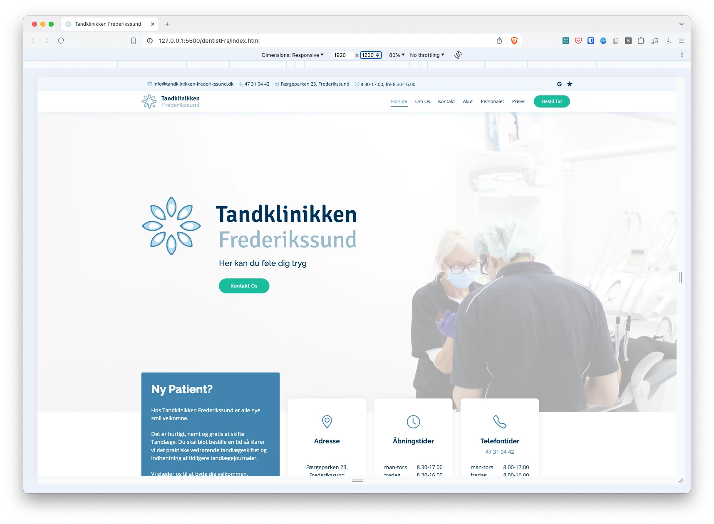

# Tandklinikken Frederikssund Website

This repository contains the source code for the [Tandklinikken Frederikssund website](https://tandklinikken-frederikssund.dk/).

## Project Structure

- **assets/**: Images and other assets used in the website.
- **css/**: Stylesheets for the website.
- **js/**: JavaScript files for interactive elements.
- **index.html**: Main homepage.

## Features

- Responsive design for various devices.
- User-friendly navigation.
- Contact forms for easy communication.
- Informative sections about services and team members.

## Installation

1. Clone the repository:
   ```sh
   git clone https://github.com/aste/dentistFrs.git
   ```
2. Navigate to the project directory:
   ```sh
   cd dentistFrs
   ```
3. Open `index.html` in your web browser to view the homepage. Use `inner-page.html` for additional pages.

## Development

### Prerequisites

- A modern web browser (e.g., Chrome, Firefox, Safari).
- A code editor (e.g., VS Code, Sublime Text).

### Running Locally

1. Open the project directory in your code editor.
2. Open `index.html` in your web browser to view the homepage.
3. For changes, edit the HTML, CSS, or JS files in the `assets` folder and refresh the browser to see updates.

## Contributing

1. Fork the repository.
2. Create a new branch:
   ```sh
   git checkout -b feature/YourFeatureName
   ```
3. Commit your changes:
   ```sh
   git commit -m 'Add some feature'
   ```
4. Push to the branch:
   ```sh
   git push origin feature/YourFeatureName
   ```
5. Open a pull request.

## Screenshots

### Mobile Version



### Vertical Tablet Version



### Horizontal Tablet Version


### Desktop Version



## License

This project is licensed under a restrictive license. Permission is required before using any part of this codebase. Please contact the repository owner for more details.
