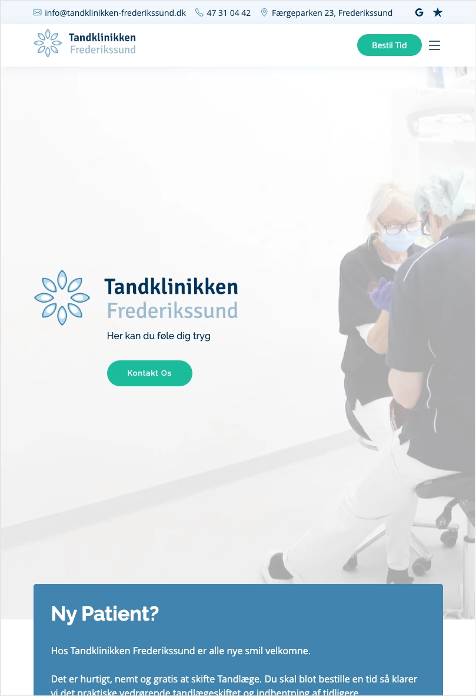

# Tandklinikken Frederikssund — README

This repository contains the source code for **Tandklinikken Frederikssund**’s website. The site is built with HTML, CSS, JavaScript, and Vite, and deployed on Netlify. It includes optimized assets, form handling, accessibility improvements, and several interactive components.

## Table of Contents

* [Features](#features)
* [Tech Stack](#tech-stack)
* [Project Structure](#project-structure)
* [Development](#development)
* [Production Build](#production-build)
* [Deployment](#deployment)
* [Screenshots](#screenshots)
* [License](#license)

## Features

* Responsive design for all devices
* Smooth animations using IntersectionObserver
* Accessible navigation and ARIA markup
* Optimized image loading with dynamic preloading
* GLightbox image gallery
* Testimonials slider using Swiper.js
* FAQ accordion system
* Smooth scrolling and mobile navigation
* Contact form with validation and Web3Forms integration
* Appointment form with IMask (phone/CPR) and Flatpickr date picker
* Structured SEO: meta tags, sitemap, robots.txt

## Tech Stack

* HTML, CSS, JavaScript
* Vite
* Bootstrap 5 + Bootstrap Icons
* Swiper.js
* GLightbox
* Flatpickr
* IMask.js
* Netlify
* Web3Forms

## Project Structure

```
├─ index.html
├─ nyheder/                    # News article pages
├─ public/
│  ├─ _redirects
│  ├─ img/
│  ├─ robots.txt
│  ├─ site.webmanifest
│  └─ sitemap.xml
├─ src/
│  ├─ assets/css/
│  └─ js/
├─ package.json
├─ package-lock.json
└─ vite.config.js
```

## Development

Install dependencies and run the development server:

```
npm install
npm run dev
```

Files to edit:

* HTML: `index.html`, `nyheder/*.html`
* CSS: `src/assets/css/`
* JavaScript: `src/js/`

## Production Build

```
npm run build
```

Output is generated in the `dist/` directory.

## Deployment

Deploy via Netlify using:

* Build: `npm run build`
* Publish directory: `dist/`

Netlify reads `_redirects`, `_headers`, and `netlify.toml` automatically.

## Screenshots

### Mobile Version


### Vertical Tablet Version



### Horizontal Tablet Version


### Desktop Version


### Lighthouse Score


## License

This project is under a restrictive license. Permission is required before using or reusing code or assets.
